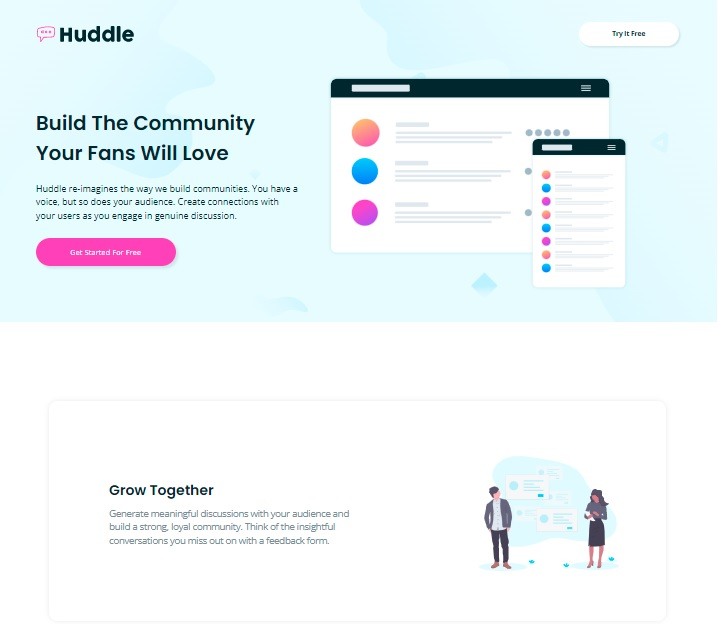
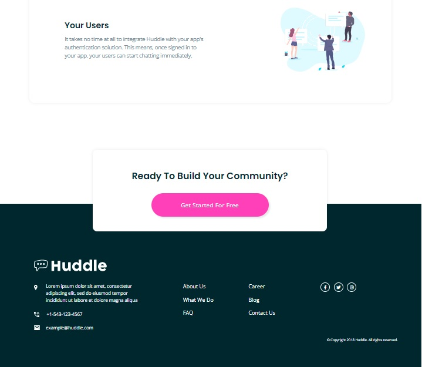
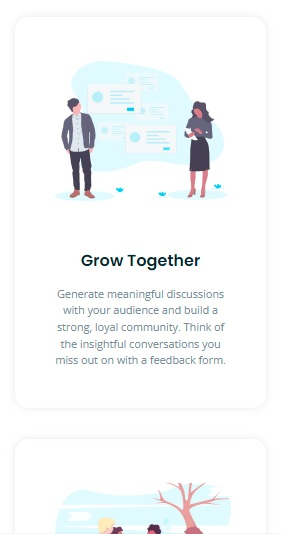

# Frontend Mentor - Huddle landing page with alternating feature blocks solution

This is a solution to the [Huddle landing page with alternating feature blocks challenge on Frontend Mentor](https://www.frontendmentor.io/challenges/huddle-landing-page-with-alternating-feature-blocks-5ca5f5981e82137ec91a5100). Frontend Mentor challenges help you improve your coding skills by building realistic projects. 

## Table of contents

- [Overview](#overview)
  - [The challenge](#the-challenge)
  - [Screenshot](#screenshot)
  - [Links](#links)
- [My process](#my-process)
  - [Built with](#built-with)
  - [What I learned](#what-i-learned)
  - [Continued development](#continued-development)
- [Author](#author)
- [Acknowledgments](#acknowledgments)

## Overview

### The challenge

Users should be able to:

- View the optimal layout for the site depending on their device's screen size
- See hover states for all interactive elements on the page

### Screenshot

| Desktop layout |
|:--:|
 

| Mobile layout |
|:--:|
 

### Links

- Solution URL: https://pavlinaps.github.io/huddle-landing-page-with-alternating-feature-blocks/
- Live Site URL: https://github.com/PavlinaPs/huddle-landing-page-with-alternating-feature-blocks

## My process

### Built with

- Semantic HTML5 markup
- CSS custom properties
- Flexbox
- CSS Grid
- Mobile-first workflow
- Sass
- BEM

### What I learned

This layout is a compilation of two layouts I made before this one, therefore there weren't any new issues.

### Continued development

I need to make sure to write a self-explanatory code so anybody would be able to take over when needed.
I also need to look up what is the best to code with margin and what with padding.

## Author

- GitHub - [PavlinaPs](https://github.com/PavlinaPs)
- Frontend Mentor - [@PavlinaPs](https://www.frontendmentor.io/profile/PavlinaPs)

## Acknowledgments

It is great that I can solve Frontend Mentor's challenges. They are all very useful for me. Every single one. Thank you!
